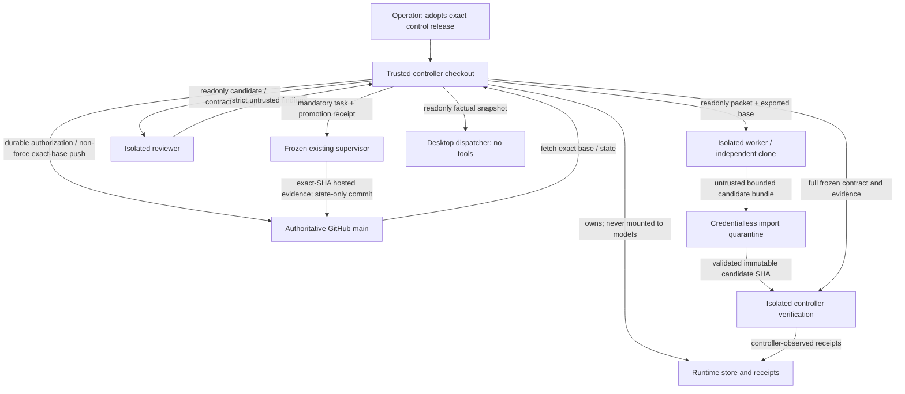

# Model orchestrator V2 — frozen candidate specification

Status: **FROZEN CANDIDATE**, 2026-10-03. This is a design contract for a future
implementation, not an installed orchestrator or an amendment to current
execution authority. [ADR 0009](../../adr/0009-model-orchestrator-v2.md) chooses
clean reimplementation from main. Read the [source audit](V1_AUDIT.md),
[implementation/acceptance plan](IMPLEMENTATION_PLAN.md), and
[amendment proposal](AMENDMENT_PROPOSAL.md) with this specification.

## 1. Objective and non-negotiable boundary

Optimize **the cheapest reliable path to a production-quality usable product**.
Existing tests are necessary, never sufficient. Real product behavior, package
capability, permission enforcement, persistence, sustained performance, and
resource bounds determine acceptance. Cost includes failed attempts, repair,
review, hosted verification, and exceptional architecture reasoning.

The product checkpoint graph remains PLAN/STATE. V2 task states are operational
facts and never an alternate graph of DONE checkpoints. Only the existing
supervisor can create completion evidence and advance STATE. V2 invokes one
bounded task cycle, then exits; no daemon, distributed scheduler, recursive
agent tree, provider plugin system, or automatic roadmap loop.

All model output is untrusted. A model cannot set scope, grant protected-path
permission, assert test success, assert cleanliness, issue promotion authority,
change checkpoint state, or certify architecture. Semantic findings inform a
contract check; deterministic mechanisms verify authorization and evidence.
An architecture model's decision becomes authority only through separately
approved tracked contract adoption, never by updating runtime JSON itself.

## 2. Components and ownership

| Component | Responsibility | Never allowed |
| --- | --- | --- |
| Operator CLI | Explicit initialize, prepare, run-one, review-one, resume-stage, pause, promote, reconcile, supervise, escalate; typed results | Shell strings supplied by a model, implicit task creation or roadmap chaining |
| Authority loader | Load immutable adopted release; resolve goal through frozen existing plan code; validate all admission contracts | Import candidate modules/config or infer trust from a branch name |
| Runtime store | Controller-only factual state, transactions, receipts, attempts, escalation packets, leases | Model-authored state overwrite, malformed-record fallback |
| Lifecycle controller | Apply legal transitions, atomic stage claims, pause and repair budgets | Skip verification/review, accept a caller PASS |
| Sandbox/transport adapter | Launch one isolated model or verifier; own process/container lifetime and bounded output | Host shell worker, controller filesystem/credential mount |
| Git/quality guards | Inspect imported object/tree/history and measurement-floor changes | Execute candidate hooks/config, prove semantics by pattern matching |
| Verification executor | Execute frozen required checks against exact immutable candidate; record observed results | Trust worker test output or substitute lower evidence classes |
| Reviewer/investigator | Read-only semantic assessment of full task plus receipts and diff | Promote, write controller records, run arbitrary candidate code |
| Promotion/handoff | Durable task-bound non-force push, synchronization, exact-SHA supervisor receipt | Legacy precheck bypass, auto rebase, reset, optional task ID |
| Existing supervisor | Hosted gates/jobs/steps/preview, product receipts, STATE/evidence completion transaction | Model verdict as evidence, worker-driven completion |
| Desktop dispatcher | Display controller-published read-only factual snapshot | Any shell, worker, model routing, pause/resume/promotion/supervisor control |

Use Python standard library, Git, existing OpenCode/Codex CLIs, an existing
container runtime, and GitHub Actions. Consolidate modules by ownership as
specified in the implementation plan; do not preserve V1's module count.

## 3. Trust domains and bootstrap

**AUTHORITATIVE MAIN** is the GitHub repository/main ref plus its approved
plan/state/evidence history. A branch name or freshly fetched SHA alone is not
authority to replace controller code. The operator pins an adopted control
release OID after its separate architecture review and acceptance suite.

**TRUSTED CONTROL CHECKOUT** is an immutable materialization of that exact
approved release, outside all model-visible writable mounts. The initial
installation records release OID, repository identity, manifest digest, pinned
Python/Git/adapter executables, and sandbox profile/image digest in
controller-owned bootstrap state. A worker cannot supply bootstrap values.
Updates require explicit operator adoption of a new reviewed release and cannot
change authority for an in-flight task.

**CANDIDATE WORKTREE** means the editable files in an independent disposable
clone, with its own `.git`. It MUST NOT be a `git worktree` sharing the trusted
repository's common Git directory. No alternates, shared object directories,
credentials, push remote, local path remote, or common-ref pointers. The
controller exports a base bundle into the worker sandbox, which imports it into
that independent clone. The worker cannot mutate authoritative refs.

**RUNTIME STATE STORE** lives under the trusted repository common Git directory
`opencut-automation-v2/`. Only the controller may write it. No worker, reviewer,
router, architecture model, candidate test, or Desktop process mounts this
directory or receives its writable file descriptors. The directory is not
part of candidate Git storage. Git ignore is not isolation.



The trusted computing base is the operator-approved release, host OS, container
runtime, pinned interpreters/Git, GitHub and the existing verifier. This design
defends against model/tool mistakes and arbitrary worker shell access. It does
not claim to defend against a compromised operator account, OS kernel, container
runtime, Git implementation, or GitHub. Candidate text remains prompt-injection
input in every model role; data never confers controller authority.

## 4. Freeze the entire authority

Preparation creates an immutable authority bundle from Git objects, not mutable
working files. A canonical UTF-8 JSON manifest lists every path, file mode,
Git blob OID, and SHA-256 of bytes, sorted by path. Hash canonical JSON with
sorted keys, compact separators, no NaN, duplicate keys, or non-string keys.
`authority_digest` binds control release OID, base OID, manifest, sandbox image
and executable digests, policy/schema versions, and the frozen task template.
Presence, absence, symlink/type, and imported-code closure are part of the
manifest. A model-provided hash is not trusted.

Freeze at least:

- AGENTS, PLAN, STATE, EVIDENCE_POLICY, architecture-policy, permanent invariants,
  AMENDMENT_BASELINE, AGENT_EXECUTION, all locked phase specs, and existing
  completion evidence used by plan validation;
- supervisor, execution plan/evidence code, architecture/plan checkers,
  infrastructure tests, all orchestrator source including push hook and schema
  validation, and any code/scripts their checks import or execute;
- the V2 specification, task templates, model/routing/escalation and sandbox
  policies, test manifests, acceptance harnesses, and evidence expectations;
- agent configuration, project/global/managed OpenCode configuration and
  enabled tool set, disabled plugins/MCP/LSP/formatters, executable versions,
  and immutable launch environment policy;
- the applicable product/design/UX/architecture/dependency contracts referenced
  by the task, source version constants, and approved comparison baselines.

Execute controller code only from the control bundle, with explicit
`repo_root` for frozen plan validation. Scrub candidate `PYTHONPATH`, config,
environment, hooks, plugins, and executable lookup. Do not import through a
candidate current directory. Source-closure changes require a new release.

Contract input precedence is: adopted control release for executable/policy
authority; exact base Git objects for product plan/state/contracts; task
template approved under that authority. The post-adoption reconciliation keeps
the adopted control source in a separate immutable lineage; it is not merged
into product main. Product-only successor commits advance the separately pinned
base. PRODUCT task pins retain the adopted immutable PLAN and select exact
current STATE/NEXT; workers cannot add or change V2 control files in product
history. The product source need not contain the control bundle. Allowed
workflow changes are candidate product inputs, never
replacements for their frozen acceptance/authorization baseline.

Before every claim, result acceptance, promotion, or supervisor invocation,
verify authority digests and the live main/base expectations. If adoption or
checkpoint state changed, retain records and stop; create a new task contract
under new authority after review. Do not re-freeze from post-worker files on
resume. `STATE` is frozen per task while live state is checked separately.

## 5. Worker and verifier isolation

V2's sole initial execution profile is a disposable Linux container: rootless
Docker Engine on Linux, or a verified Docker Linux VM on macOS. Use an existing
runtime only; agents do not install it or change platform toolchains. Host
controller support is Linux/macOS with local POSIX filesystems and tested flock,
atomic replace, and fsync. A Windows operator may use a Linux controller on
its Linux filesystem; native Windows controller support is outside V2's initial
profile. The OR product's cross-platform evidence obligations remain intact.

For each stage the controller inspects effective container settings, image
digest, mounts, namespaces, user, resource limits, and live instance identity.
Require non-root user, no privileged mode, no added capabilities, no host PID
or network namespace, no devices, no container socket, no host home/SSH agent,
no host controller/common Git path, no reusable host tool cache, and no control
credentials. Read-only container root; writable candidate and bounded scratch
volumes only. Set CPU, memory, PID, disk/output and wall-time limits from the
task/profile; default-unbounded is rejected. On unsupported runtime/settings,
return `ISOLATION_UNAVAILABLE` and launch zero workers. Never fall back to a
host subprocess with the same write capability as the controller.

Worker receives an immutable packet file and a task-scoped model-provider
credential with only inference authority, if necessary. Never expose GitHub
write tokens, controller authorization keys, application secrets, or unrelated
provider accounts. Provider credentials are excluded from logs and receipts.
Model network access is an explicit capability; there is no controller network
listener. Verifiers receive no model credential and run without network except
separately approved dependency staging. Reviewer/router/architecture containers
mount only immutable inputs and private scratch. Reviewer shell is denied;
needed observations are supplied by controller-executed checks.

Agent permissions remain defense in depth. A frozen no-subagent/no-tool-routing
configuration is required, but cannot be used as the OS write boundary.
OpenCode project configuration may override global settings; just setting
`OPENCODE_CONFIG` is insufficient. The sandbox launch view overlays every
version-specific discoverable project/config/agent/plugin/tool directory with
read-only frozen contents, including previously absent config names, and uses
a private controlled home/managed configuration. Remote configuration and
automatic plugin loading are disabled or made unavailable. The independent
candidate export view excludes these controller overlays; a candidate commit
that changes actual control paths is rejected. If the pinned CLI cannot prove
the effective config is entirely frozen, that adapter is unavailable.

The effective policy must deny nested agents, model CLI spawning through tools,
and uncontrolled process launch for router/reviewer/architecture roles. A worker
can run bounded build tools inside its isolated process/resource budget; it
cannot acquire additional controller leases. Do not claim arbitrary shell can
prevent every extra inference call: only the controller's one-dispatch invariant
is authoritative, and provider budget/credential limits contain unauthorized
calls. Such behavior rejects the attempt when observed.

The controller kills/stops the entire container on interruption and verifies
no stage instance remains running before releasing/reclaiming its task lease.
Persist container ID, host boot identity, owner nonce, stage, and lease epoch.
Loss of controller does not prove a worker is dead. A restart first inspects
and stops the recorded instance; uncertain liveness blocks another writer.

Official references checked on 2026-10-03:
[OpenCode permissions](https://opencode.ai/docs/permissions/),
[OpenCode configuration precedence](https://opencode.ai/docs/config/),
[Docker rootless execution](https://docs.docker.com/engine/security/rootless/),
[Docker resource limits](https://docs.docker.com/engine/containers/resource_constraints/).
These motivate the boundary; adapter conformance tests against the pinned
installed version are still required before activation.

## 6. Tracked and runtime memory

Tracked memory holds specifications, strict schemas/policy, task templates,
test/harness manifests, dependency decisions, and adopted architecture contracts.
No chat transcript is authority. No hidden chain-of-thought is persisted.

Controller runtime layout:

```text
<trusted-common-git-dir>/opencut-automation-v2/
  bootstrap.json           # explicit adopted release identity, no credentials
  state.json               # sole mutable authoritative operational snapshot
  locks/state.lock          # short transaction lock
  locks/task-<id>.lock      # one writer/stage per task
  locks/integration.lock   # main/ref/completion mutations
  objects/<sha256>.json    # immutable contracts, evidence and authorization receipts
  artifacts/<sha256>/      # bounded controller-captured logs/material
  telemetry/              # factual outcomes; rotation, never authorizes anything
  published/status.json   # atomically replaced sanitized read-only UI snapshot
```

IDs are controller-generated restricted ASCII (`[A-Za-z0-9_-]{1,64}`); no
absolute paths, traversal, separators, arbitrary filenames, or model-assigned
task identity. All JSON has strict exact-key/type/enum/length checks and a
version. Reject duplicate keys, bool-as-int, non-finite numbers, corrupted or
missing active records, symlinks, and unsupported versions. Only explicit
initialize can create a new store; read-only inspection must not initialize,
mkdir, lock, discover models, or repair anything.

`state.json` holds sequence, pause generation, active checkpoint task, stage
claims, lease epochs, attempts, and receipt pointers. Under `state.lock`, write
immutable receipt objects first (exclusive create, validate content digest,
fsync), then replace a temp state file and fsync its parent directory. One
snapshot replacement atomically publishes all associated field/state changes.
Unreferenced receipt objects after a crash have no authority and can be retained
for diagnosis. Do not implement multi-file task/run/promote updates as a pretend
transaction. Bound record/log sizes and archive settled tasks by explicit
controller maintenance. Permission bits and hashes assist corruption detection;
absence of worker write capability establishes ownership.

## 7. Task and admission contract

One task targets exactly the resolved NEXT checkpoint. Control-plane
implementation phases use a separate architecture-task kind authorized by an explicit disabled-build architecture task, and cannot impersonate product checkpoint tasks.

Preparation deterministically validates plan/state, exact base/remote identity,
verified schema versions, allowance intersection, evidence bindings, environment
capabilities, acceptance harness coverage, and budgets before READY. Operator
input chooses among approved task templates; a free-form model goal does not
authorize scope. No arbitrary command text is accepted from a model.

Every immutable task includes these typed fields:

| Group | Required values |
| --- | --- |
| Identity | schema version, controller task ID/kind, repository identity, exact checkpoint, exact base SHA, candidate branch, authority digest, template digest |
| Scope | bounded goal, explicit out-of-scope, allowed exact paths/subtrees, forbidden paths, frozen PLAN protected-workflow allowance, required documentation/tests |
| Contracts | affected invariant IDs and source digests, project/recovery/IPC effects, relevant design/UX/dependency/licensing decisions |
| Real product goal | user action, observable outcome, production boundary, supported/error cases, persistence/permission expectations |
| Verification | ordered required check IDs, exact argv/cwd/environment profile, harness digest/case inventory, expected exit/result, execution boundary, time/resource limits |
| Acceptance | all PLAN evidence classes and existing bindings, real journey cases, packaged artifact/platform/capability/environment identity, relaunch/clean-environment requirements |
| Performance | applicability decision; explicit absolute budgets, comparison baseline/non-regression limit, fixture/measurement method, duration, sample rules and ownership bounds |
| Execution | permitted role/model enrollment set, token/cost/wall/tool-call budget, at most two speculative corrective attempts per subsystem/gate, stop conditions |
| Repair/resume | original failure episode ID, attempt budget/history pointers, authorized causal hypothesis/discriminating evidence if required, permitted resume stage |

Every required check is a command array; no shell interpolation. A trusted shell
script may be an explicit pinned check input, with its source digest included.
The candidate cannot edit the check catalog used to decide its own validity.
Task digest covers **all** task fields, including goal, role, authority, harness
and environment identities. Physical workspace paths are controller-owned
locators outside the contract; worker supplies no host path.

Forbidden wins over allowed. Empty allowlist authorizes no changes. Avoid `**`
for product tasks. Protected permission is the intersection of explicit task
scope and trusted PLAN's exact-path allowance. No task can authorize STATE,
PLAN, invariants, evidence, controller/policy/config or acceptance-floor changes
without a separately approved architecture amendment.

Missing measurable bounds or a feasible real journey is
`EVIDENCE_CONTRACT_INCOMPLETE`, before READY. A bounded read-only diagnostic may
collect missing facts. It cannot quietly invent a budget or produce promotion
authority. Tasks with no performance relevance need an explicit, trusted
applicability rationale; workers cannot use `N/A` to waive realtime obligations.

## 8. Candidate import and guards

After a worker stops, the controller independently discovers actual HEAD,
ancestry, branch, files, and commit objects in a credentialless quarantine.
Worker prose and exit zero are not candidate evidence. Never run candidate Git
configuration, hooks, aliases, filters, external diff, or executable shim on
the host. Disable replacement refs/grafts; reject shallow histories, alternates,
unexpected refs, and unsupported submodules. Use trusted Git with sanitized
config/environment and bounded import/fsck. Import only the exact base-to-HEAD
history into a fresh controller-owned repository; model-owned refs/index flags
cannot certify cleanliness. Compare a no-follow filesystem manifest with the
imported tree; only explicitly permitted ignored build scratch is exempt.

An interrupted dirty workspace is preserved. A clean committed candidate with
no remaining worker goes directly to candidate verification, even if the model
never printed its handoff. No new commit is required merely to recover it.

Guard every intermediate commit and the aggregate base/candidate diff. Parse
NUL-delimited byte paths/status entries and reject malformed/ambiguous paths,
type changes, unsupported modes, and traversal/symlink escapes. Check both old
and new rename/copy paths and delete/add pairs. No normalization may turn an
ambiguous filesystem path into an authorized one. Empty product diff, branch or
base mismatch, dirty product files, or unauthorized paths rejects the candidate.

Measurement-floor checks have two levels:

1. Deterministic veto: forbidden control change, missing required test/case or
   harness, skipped required execution, removed required resource bound,
   unauthorized dependency/capability, changed required command/binding,
   unauthorized failure-tolerance policy. These cannot be cleared by a model.
2. Deterministic flags: changed assertions, retries/timeouts, `continue-on-error`,
   `|| true`, workflow conditions, ignored errors, mocks/test doubles, host
   executable resolution, environment/permission changes, feature narrowing,
   fallback/geometry changes, resource-reuse or ownership changes. Structured
   YAML/Python/supported-language inspection where already available plus diff
   comparisons are detection aids, not semantic proof. All task paths and
   deleted lines participate. Independent review interprets each flag.

Any flag remains a promotion block until a structured disposition is bound to
the exact candidate, old/new measurement floor, contract, and repository
evidence. Cosmetic false positives can be closed with an inspectable citation.
Actual lowering of fidelity cannot be waived by reviewer PASS. A necessary
required-test change must have explicit task authorization and preserve the
approved acceptance floor; otherwise stop for an architecture amendment.

## 9. Controller-executed verification and evidence

The live order is:

```text
imported candidate
  -> scope/protection/fidelity guards
  -> LOCAL_VERIFY: controller executes every required deterministic check
  -> acceptance-plan/harness and available supporting evidence receipts
  -> independent semantic review
  -> PROMOTION_READY (implementation eligibility, not product acceptance)
  -> explicit promotion / supervisor exact-SHA hosted product evidence
```

Verification uses a fresh immutable candidate materialization and frozen harness
in an isolated verifier, not the worker's tool cache or mutated test checkout.
Tests exercise real candidate production modules through an approved harness;
baseline required tests/case inventory are retained independently. Candidate
test additions are supporting checks and reviewed additions, not the authority
for deleting old required cases. Trusted infrastructure checks execute from
the control bundle and are passed the candidate root explicitly.

A controller receipt records task/authority/contract/candidate/tree/harness
digests, check ID, exact argv/cwd/env-profile (redacted), executable/image
identity, start/end, process/container identity, exit status/signal/timeout,
expected and executed cases, skips, result artifact/log digests and resource
observations. The controller observes process termination; candidate-written
`PASS` JSON is not enough. A required failure, missing result, timeout, skip,
mutation, unresolved environment block, or lack of harness identity prevents
PROMOTION_READY even when reviewer says PASS. Explicit checks are individually
recorded; a summary may not hide a failed command.

Outcome is one of PASS, FAIL, LOCAL ENVIRONMENT BLOCKED, or NOT RUN. Blocked is
availability, never success or a source defect. Required local headless checks
must pass before promotion. They may not be reassigned to post-push CI by a
worker. Native product checks are declared hosted-only in the approved contract
and remain pending through promotion. No local OR application/emulator/simulator
or Developer Preview opens without the user's explicit authorization.

Reuse all EVIDENCE_POLICY classes and bindings:

| Class | What it can establish |
| --- | --- |
| STATIC | Formatting, type/static, scope and policy checks |
| UNIT | Isolated component invariants |
| INTEGRATION | Real component/API cooperation at the declared boundary |
| NATIVE_RUNTIME | Actual linked native runtime in a declared platform environment |
| PACKAGED_RUNTIME | Capability through the actual distributed package/dependencies/permissions |
| USER_JOURNEY | Real intended human journey and outcome through product UI/API as scoped |
| CLEAN_ENVIRONMENT | Supported environment stripped of undeclared developer/host capabilities |
| PERSISTENCE_RELAUNCH | Save, process exit/relaunch, reopen, restored state/capability |
| PERFORMANCE | Measured latency/frame pacing/throughput against declared bounds |
| RESOURCE_STRESS | Bounded lifetime/concurrency/memory/descriptors under sustained stress |
| CROSS_PLATFORM | Required platform matrix, not inferred from one platform |

A local class receipt is supporting evidence only. Hosted main push gates,
successful required jobs/steps, and preview verification stay mandatory exactly
as in existing policy. Before promotion, verify the acceptance plan has an
approved real harness and every required binding; do not require nonexistent
main-push evidence before the push that can create it. The authorization
explicitly records pending hosted classes. PROMOTION_READY therefore means only
eligible to publish an implementation for authoritative verification.

Named successful steps alone cannot establish fidelity or numeric bounds. The
proposed amendment extends schema-2 completion records with a validated
`control_plane_receipt` containing task/authority/promotion and accepted
production-artifact receipts; it retains the existing class proof fields and
does not invent new classes. Frozen harness code is fetched/materialized at the
approved authority SHA, outside candidate write capability. Product build/tests
run credentialless; a separate trusted collector associates real process
observations/cases/measurements with exact run/job/attempt/artifact identity.
Candidate workflow changes cannot substitute echo/mocks for the frozen harness.
Expired/missing artifact, skipped case, wrong package/hash/permission/capability,
or missing metric prevents completion. Controller retrieves GitHub facts;
models never submit hosted success flags. Historical records remain unchanged.

Hosted acceptance executes through a reusable
`.github/workflows/control-plane-acceptance.yml` pinned to a separately approved
immutable workflow SHA in the adopted manifest. Candidate-owned push wrappers
may call it, but cannot choose its authority, case inventory, bounds, or verifier
code. The frozen job rejects source SHA other than the parent run's exact head,
resolves checkpoint/classes from the approved contract, and checks package
identity independently. Candidate build execution and package processes have
no write capability to harness/collector files, receipt outputs, or publishing
credentials; separate principals/containers and package permission enforcement
are certified per hosted platform. If that boundary is infeasible, acceptance
is unavailable until an architecture decision supplies a faithful alternative.

The supervisor checks the parent run's GitHub `referenced_workflows` SHA/path,
the successful frozen called job identities/attempts, exact immutable caller
`uses` binding and artifact identity, not a digest echoed by candidate YAML.
An omitted call, fake echo, skipped frozen job, wrong immutable SHA, duplicate
receipt artifact, or unavailable provenance fails. Existing required main-push
gates/classes/jobs/steps stay necessary; these independent receipts strengthen
their fidelity. The frozen reusable workflow may be at a reviewed ancestor of
the final adoption commit, avoiding a self-referential workflow SHA; bootstrap
pins both OIDs and their manifest. It does not launch a separate model or service.
GitHub documents immutable reusable workflow references and run provenance in
[reusable workflows](https://docs.github.com/en/actions/how-tos/reuse-automations/reuse-workflows)
and the [workflow-run API](https://docs.github.com/en/rest/actions/workflow-runs).
Pin API-version conformance and fail closed if required provenance is unavailable.

Review cannot prove all software semantics, and metadata cannot prove a journey.
Trusted harness observations, boundary/capability checks, semantic review, and
failure journeys jointly enforce product fidelity. Any evidence-contract
impossibility stops for architecture, never automatic down-classification.

## 10. Performance is correctness

For realtime/media/render/input/export/persistence, task admission defines
queue/in-flight limits, memory/allocation bounds, descriptor/frame ownership,
reuse expectations, UI/render-thread blocking limits, latency percentiles/frame
pacing, cancellation deadline, generation/stale-work invalidation, stress
duration, and supported workload/device matrix. Measurements bind fixtures,
package, software/hardware fallback, tool version, sample count, exclusions,
and comparison baseline. Required bounds are numerical or explicit structural
properties tested by a frozen harness; no executor-selected thresholds.

Absolute bounds and non-regression bounds both apply. Startup skipped frames,
per-frame reconstruction/copies, leaked descriptors/leases, and sustained queue
growth are investigated, not hidden by warm-up exclusions or retries. A
functionally correct renderer with predictable severe blocking or unbounded
resources is rejected. Hardware optionality never weakens the authoritative
software path. See the amendment's proposed INV-PERF-CORRECTNESS wording.

## 11. Model roles, routing, and telemetry

Model identity is policy data, never a dependency in Python or agent prose.
[MODEL_POLICY.json](MODEL_POLICY.json) deliberately contains no enrolled provider
IDs: deployment must enroll currently available models with certified role,
family, provider, adapter version, reasoning capabilities, budget and observed
reliability. Historical promotional names are examples, not availability claims.
Missing/discontinued/auth/quota-limited models are availability outcomes.

| Role | Authority and default reasoning |
| --- | --- |
| ROUTER_TRIAGE | Optional one fixed label from facts; no tools; LOW requested; advisory only |
| MECHANICAL | Narrow deterministic editing within immutable task; LOW/default according to certified need |
| IMPLEMENTATION | Bounded implementation; lowest qualified effort at the task-class floor (ordinary implementation MEDIUM; security/authority HIGH) |
| INVESTIGATION_REVIEW | Evidence-based root cause or independent candidate review; HIGH requested |
| ARCHITECTURE | Exceptional decision/contract only; HIGH requested; no implementation/wait/build/poll |

The controller computes hard stop/availability/repair/legal-stage facts first.
An optional Jev-like label cannot override them. Do not call a router merely to
display status or repeat a deterministic conclusion. Role-specific enrollment
and family independence are mandatory. Unknown family is not independent.
No available reviewer of another family -> REVIEW_PENDING. No silent fallback
to an unqualified/free/experimental model. Explicit model lock requires
controller-authorized enrollment for that role; packet preferences are advisory.

Record requested effort, transmitted variant and confirmed effective effort
(or DEFAULT_PROVIDER / UNCONFIRMED). Never label reviewer HIGH when adapter was
constructed with defaults. If a task requires a confirmed minimum effort and
adapter cannot supply it, leave stage pending. Capability discovery distinguishes
listed ID, authentication, quota/pricing availability, certified transport, and
task-class qualification. A free suffix alone proves none of these.

Select lowest expected total acceptance cost among qualified candidates under
the operator-approved policy/budget. Include repair/review/hosted cost, failure
risk and evidence collection. Cold-start selection uses approved conservative
qualification, never extrapolates a fake-test pass rate. Telemetry records task
class, model/provider/family/version, requested/effective reasoning, candidate
outcome, reviewer defects/severity, attempts, wall time, tool loops, acceptance
outcome, tokens/cost when available (unknown remains null). Keep denominators
and rejected attempts; do not tune policy from success-only samples. Policy
changes require a new adopted release or approved configuration version; runtime
stats cannot self-authorize model/safety changes.

The shared CLI loads enrollment against the **durable admitted task** before
claiming a worker or reviewer stage. `--enrollment-digest` is an optional checksum,
not authority: its canonical record digest must already be present in the task's
`role_enrollment_ids`, and `operator_adoption_identity` must match the executing
external build authorization. The loader returns an immutable controller
capability bound to the exact task and authority. Raw catalog records or model
JSON cannot enter selection or transport. The transport additionally compares
`adapter_certification_digest` to the actual pinned binary/runtime identity.

Each pinned enrollment carries explicit role/task-class qualification evidence:
qualified reasoning efforts, quality result, scope compliance, tool correctness,
and evidence digest. Availability records contain `state`, `quota_remaining`,
and `quota_scarce`; an external availability map can veto, but cannot grant,
eligibility. Pricing records contain `kind` (`free`, `prepaid`, `metered`, or
`unknown`), per-effort expected monetary `effort_cost_microusd`, expected retry
cost, and operator `budget_pressure_microusd`. These are externally approved
observations, not controller scraping, billing, or automatic learning. Unknown
pricing is non-rankable; no missing price is interpreted as zero.

Selection enforces both the task monetary budget and any enrolled cost ceiling.
Expected effective operator cost sums effort cost, retry cost, and approved
budget pressure. Already-paid available capacity can therefore outrank metered
usage; exhausted quota cannot. Paid or scarce-quota models use the lowest
qualified supported effort meeting the floor. Genuinely free models prefer the
highest qualified effort only when quota is not scarce. Supported efforts are
NONE, LOW, MEDIUM, HIGH, XHIGH, and MAX, with an opaque DEFAULT provider setting
that never proves a higher reasoning floor. `--task-class` and
`--required-reasoning` constrain selection further; review always retains at
least HIGH. A provider variant or absent confirmation is recorded honestly,
never fabricated as effective HIGH/MAX. Future provider/qualification/cost
changes require new explicit pinned observations, not marketing-name branches.

The actual claim path atomically publishes an attempt object with its worker
lease. Review claims publish their own episode without changing that lease;
initial execution permits at most two speculative corrections, then one pinned
independent causal diagnosis/repair. Stage names and process restarts cannot
reset an episode. Pause publication and promotion dispatch share the state lock.

Live acceptance invokes the same `claim_stage`, `run_worker`,
`import_and_verify`, and `run_reviewer` used by the CLI. Verification consumes
the preserved worker output. Runtime HOME is writable on the bounded volume;
policy/config and provider credential shadows remain immutable. Runtime file
limits are separate from bounded stdout/stderr so SQLite WAL does not inherit
the smaller transcript limit. Quality flags remain blocking until an exact
independent schema-bound disposition; a reviewer cannot waive failed checks.

Hosted evidence uses exact Git source/case inventories and downloaded receipt
contents sealed in a separate job with no checkout or package execution.
Independent final review receives the exact release source and live/controller
facts readonly, with a fresh session and no execution/nested-agent tools.
Every lifecycle claim in a PASS must cite existing source and evidence lines.
All of these receipts remain supporting facts, never product adoption.

## 12. Reviewer and structured transport contracts

Reviewer gets the exact full task, authority/template digest, candidate/base,
diff and original production source, required tests/receipts, remaining hosted
obligations, guards and each flag, real journey and performance budgets,
regression guards, prior factual failures and competing hypotheses. Read-only
inspection may run in parallel on immutable inputs; only one selected report
per review claim can be accepted. No reviewer can mutate the candidate or run
candidate tests with controller authority.

Strict response object: version, echoed task/contract/candidate identity,
verdict (PASS / DEFECT_FOUND / BLOCKED / INCONCLUSIVE), coverage list, findings,
quality-flag dispositions, and unresolved questions. Each finding has severity,
classification (PROVEN / SUPPORTED / PLAUSIBLE / UNKNOWN), exact repository or
receipt citation, factual claim, competing hypotheses where causal, and the
discriminating observation/check needed. PASS means no blocking defect found
under this contract. It never means product accepted or checkpoint DONE.
Unknown blocking obligations cannot become PASS. Repeated historical signature
supports a hypothesis only; no automatic infrastructure verdict or rerun advice.

Controller adds trusted model/session/family/effort metadata independently of
model echoes. Reject unknown keys, wrong types/IDs, arbitrary prose, malformed
JSON, omitted coverage, ambiguous flags, same/unknown family, stale candidate,
or unsupported classification. Do not fill missing model response fields with
values that make it appear valid. A non-PASS cannot issue promotion authority.

OpenCode event parsing lives in one pinned adapter shared by roles. Enforce byte,
event, elapsed-time limits, UTF-8, known envelope/session/turn identity, error
handling, terminal process/event success, one final payload, and strict
duplicate-key-free JSON. Earlier text, tools, reasoning, or incomplete output
cannot masquerade as final JSON. New event version is an adapter-unavailable
state until certified. Worker Git output is authoritative instead of textual
handoff parsing. Router emits a single fixed label. Architecture emits the
structured decision defined below. No hidden reasoning tokens are stored.

## 13. State machine and illegal states

State and receipt requirements are one transaction. A string enum alone is
insufficient. Missing receipts for a purported state fails closed as corrupt
state, not an invitation to reconstruct favorable authorization.

```mermaid
stateDiagram-v2
  [*] --> PLANNED_TASK
  PLANNED_TASK --> READY: admitted frozen contract
  READY --> CLAIMED: atomic pause and lease check
  CLAIMED --> IMPLEMENTING: persisted launch identity
  IMPLEMENTING --> INTERRUPTED: lost process / bounded interruption
  INTERRUPTED --> CLAIMED: same contract; no surviving process
  IMPLEMENTING --> CANDIDATE: immutable import and clean product tree
  INTERRUPTED --> CANDIDATE: recovered committed candidate
  CANDIDATE --> LOCAL_VERIFY: guards pass
  CANDIDATE --> REJECTED: scope/protection violation
  LOCAL_VERIFY --> REVIEW_PENDING: checks pass; pause/unavailable reviewer
  LOCAL_VERIFY --> REVIEWING: checks pass; atomic review claim
  LOCAL_VERIFY --> REJECTED: failed required check
  REVIEW_PENDING --> REVIEWING: atomic review claim
  REVIEWING --> REVIEW_PENDING: interruption / incomplete report
  REVIEWING --> REJECTED: blocking finding / invalid contract
  REVIEWING --> PROMOTION_READY: complete receipts; no unresolved block
  REJECTED --> DIAGNOSTIC: evidence / budget requirement
  DIAGNOSTIC --> READY: authorized causal repair; old receipts revoked
  DIAGNOSTIC --> ESCALATED: exceptional contract question
  ESCALATED --> ESCALATION_DEFERRED_QUOTA: quota availability
  ESCALATION_DEFERRED_QUOTA --> ESCALATED: explicit availability resume
  ESCALATED --> DIAGNOSTIC: validated decision persisted
  PROMOTION_READY --> PROMOTING: explicit authorized intent
  PROMOTING --> REMOTE_PROMOTED: remote candidate observed
  REMOTE_PROMOTED --> LOCAL_SYNC_PENDING: local alignment blocked
  REMOTE_PROMOTED --> PROMOTED: clean local alignment
  LOCAL_SYNC_PENDING --> PROMOTED: deterministic reconciliation
  PROMOTED --> SUPERVISOR_READY: exact task-bound handoff
  SUPERVISOR_READY --> HOSTED_VERIFY: atomic supervised invocation
  HOSTED_VERIFY --> DIAGNOSTIC: failed / insufficient evidence
  HOSTED_VERIFY --> ACCEPTED: supervisor completion and hygiene proven
```



Additional precisely limited transitions: PLANNED_TASK -> DIAGNOSTIC for admission
failure; CLAIMED -> INTERRUPTED if launch cannot be established; LOCAL_VERIFY ->
LOCAL_VERIFY on resumed incomplete verification; REVIEWING -> DIAGNOSTIC for
integrity failure; PROMOTING -> PROMOTION_READY only after reconciliation proves
remote is still exact base and no outstanding push exists; PROMOTING -> DIAGNOSTIC
if remote differs from base/candidate; PROMOTED -> DIAGNOSTIC if subsequent main
drift invalidates handoff; REMOTE_PROMOTED or LOCAL_SYNC_PENDING -> DIAGNOSTIC
on a proven unexpected remote advance. READY, INTERRUPTED, REVIEW_PENDING,
PROMOTION_READY, or SUPERVISOR_READY -> DIAGNOSTIC is permitted on an observed
contract/base/authority contradiction, revoking any readiness pointer while
preserving its old receipt as history. Corrupt state itself is a refusal to act,
never permission to rewrite the record. DIAGNOSTIC -> SUPERVISOR_READY is allowed only for the
same already-promoted candidate with its immutable authorization intact, a
controller-proven transient availability cause, and operator-authorized resume.
Repair creates a new candidate cycle with invalidated previous readiness; it
never rewrites already published history. A repair of a hosted failure uses the
current published SHA as its new exact base and a new linked task contract.

A paused flag is orthogonal to lifecycle. Availability has a typed reason,
never masquerades as repository failure. Completed/rejected work is retained;
no generic FAILED -> RUNNING loop. ACCEPTED is terminal and exists only after
the supervisor's completion commit and its hygiene receipt are independently
verified. Its implementation SHA and state-commit SHA are distinct fields.

## 14. Locks, fencing, pause, and attempts

Three locks have separate meanings:

- Task lease: exclusive OS lock per task, held for one active bounded stage and
  its process reconciliation. Prevents two writers or concurrent review/result
  publication for that task. Lease epoch fences stale result packets.
- Runtime lock: short snapshot transaction lock; never held during a worker,
  test, model request, network push, or hosted wait. Serializes pause/claims and
  publishes receipts atomically.
- Integration lock: exclusive main/ref/completion mutation lock, held across
  promotion and synchronization, supervisor handoff alignment, and the
  supervisor's completion commit/push transaction. It does not mean a worker
  lease and is not held merely while polling hosted evidence.

Lock order: task lease, then integration lock when needed, then runtime lock.
Pause uses runtime lock only. A command must never wait for a task/integration
lock while holding runtime lock. OS locks are released by process exit, but
controller takeover must still reconcile recorded containers/push intent.
Result application checks task ID, lease epoch, stage nonce, expected state
sequence, authority and candidate. A stale process result cannot mutate state.

Claim algorithm: acquire task lease; under runtime lock re-read pause generation,
current state, task contract, budgets and liveness; atomically reserve the
attempt, assign epoch/nonce, and set CLAIMED. Only then launch. A delayed
contender must re-read; it cannot dispatch from an old PENDING/READY snapshot.
Default policy admits one active implementation task for the current checkpoint.
Read-only inspections on immutable artifacts can be parallel; no extra product
writer or promotion operation follows from that capability.

Pause behavior is fixed as `next-stage`: pause before CLAIMED starts zero
workers. Pause after worker claim permits that worker plus controller candidate
import/guards/required verification to settle its already claimed bounded stage;
it starts no new reviewer/worker/task/escalation/supervisor/promotion stage.
A current review or verification stage may finish and persist receipts; a
current push must reconcile remote/local safely and is never cancelled midway
by pause. Record REVIEW_PENDING or the appropriate settled state with reason
PAUSED at the boundary. Every stage claim rechecks pause atomically. Unpause
changes generation, not authorization or attempt history, and starts nothing
by itself. Read-only reconciliation remains allowed while paused; it must not
start a new push or a new model. User cancellation is separate and stops a
container after preserving work.

Reserve an attempt at claim, record every launch and speculative repair,
including process/tool failure, changed fingerprint, timeout increase, AVD
restart, model swap and resumed worker that performs another correction.
Stable episode grouping uses checkpoint + subsystem + acceptance gate/case;
error fingerprint is supporting identity, not a reset mechanism. Resume of an
unchanged interrupted implementation consumes dispatch budget but does not
erase previous corrective attempts. After at most two speculative corrections,
no further implementation admission without exact failure evidence, a
falsifiable root cause, reproduction/discriminating result, and causal patch
explanation. That packet receives independent investigation and bounded repair
authorization. Another evidence-backed causal failure triggers architecture
according to frozen policy; no endless new two-attempt budget. Diagnostic tasks
are read-only unless a separate explicitly scoped harness task is authorized;
they cannot modify product behavior or lower the acceptance floor.

A diagnosis produced after failures may be supplied with `approve-causal`
(`--diagnosis-controller`, `--diagnosis-bootstrap`, exact `--task-id` and
`--subsystem`). The separately sealed external authority must have the identical
release/build payload; its committed packet and evidence must bind the original
task, episode and published attempt digests. The runtime publishes the approved
facts atomically without replacing its bootstrap, task or attempt history.
Source certification reviews also reserve persistent `source_reviewer` attempts;
a restart reopens the same exact-release authority/store rather than creating a
new retry budget. These read-only claims create no worker settlement or promotion.

At most one additional admitted causal repair per episode is allowed without
a new architecture decision. If it fails, persist the full ledger and escalate;
the architecture decision must explicitly authorize any further bounded repair.
Changing model or error text never creates a fresh episode budget.

## 15. Durable promotion authorization and remote/local recovery

The controller writes a content-addressed authorization receipt only after all
required local checks, guard dispositions, acceptance readiness, and independent
review are present. Runtime state points to that receipt; a caller supplies only
task ID. Bind repository/checkpoint/NEXT-state digest, authority/template/task
digests, exact base and candidate/tree/history digest, reviewed SHA, reviewer
model/family/session/effort/report digest, complete guard/test/acceptance-plan
receipts, pending hosted obligations, lease epoch, issuance sequence, policy
and comparison baseline. Verify it against original controller-owned records,
not a second self-contained packet copied inside the receipt.

No `promote(precheck={ok:true})`, writable authorization-file argument, or
optional task identity exists. No force, merge commit, or automatic rebase.
Explicit promote acquires task/integration locks, revalidates every binding,
checks paused state under runtime lock, fetches from the pinned origin identity,
and requires clean local main == fetched main == authorized base. Candidate
objects already reside in the trusted integration repository, imported without
executing candidate code. Candidate SHAs cannot be inferred from a branch name.

Ordinary `git push <candidate>:refs/heads/main` alone is not an exact-base guard:
another writer can advance main to a candidate ancestor between fetch and
push. Use a frozen controller-owned pre-push hook via trusted `core.hooksPath`.
The hook verifies the *advertised* old remote OID for that push equals the
authorized base, the single source OID equals candidate, destination is main,
and repository identity/intent match. Git's receive-pack ref transaction then
rejects a concurrent old-OID mismatch. Use a normal non-force push; do not use
`--force-with-lease` as a substitute. Pin and integration-test this Git behavior.
If the installed transport cannot enforce it, promotion is unavailable. External
writers to main must use normal protected workflows; any unexpected advancement
stops this task instead of rebasing it.

Before network mutation, atomically persist PROMOTING with authorization digest,
base/candidate, destination, intent nonce, expected state sequence and push
start fact; fsync. Then execute push. Acknowledgement, loss of connection,
controller crash, or post-push fetch failure never erases the intent.
Reconciliation under integration lock queries the real remote, independently of
stale tracking refs:

| Observed main | Recovery |
| --- | --- |
| Exact candidate | Persist REMOTE_PROMOTED even if acknowledgement was lost; never push again |
| Exact base | Prove no surviving push process; intent was not observed committed. Return to PROMOTION_READY with same receipts; another push needs explicit authorization/pause check |
| Any other SHA | DIAGNOSTIC: remote advanced/conflicted; retain intent and observations; no retry/rebase/force |
| Unreachable/unknown | Remain PROMOTING with availability reason; no second push while outcome unknown |

After REMOTE_PROMOTED, align local main using ff-only if clean and at base.
Failure leaves LOCAL_SYNC_PENDING with remote candidate receipt intact, local
HEAD/status/error recorded and authorization retained. Operator resolves local
dirty/diverged state without controller reset/clean/discard. On reconcile,
remote must still equal candidate; local clean candidate -> PROMOTED, local
clean base -> ff-only and PROMOTED, anything else remains blocked. A crash after
local fast-forward but before record write is reconciled by the same comparisons.
No full worker/test/review rerun is needed for unchanged immutable receipts.

Locks prevent cooperating local integration races. Server old-OID checking and
post-operation remote inspection handle external writers. If an external writer
advances main after the candidate, promotion cannot be called product accepted;
handoff stops unless a separately authorized recovery explicitly binds the new
state. Never conceal that published main is awaiting hosted verification.

## 16. Supervisor handoff and completion recovery

Handoff requires task ID, exact checkpoint, promoted implementation SHA,
matching authorization and remote-promotion receipts, current NEXT, unchanged
frozen control contracts, clean main branch, and HEAD == fresh origin/main ==
promoted SHA. Revalidate under task/integration lock; no invocation on an
ordinary branch and no `task_id=None` path. Persist SUPERVISOR_READY and a
controller-generated handoff receipt before invoking the frozen supervisor
with explicit repository root and mandatory task/promotion receipt identity.
Supervisor independently validates that receipt against controller store.
Prepare/preflight remain read-only; they confer no mutation authority.

Existing exact-SHA main-push gates, all jobs/steps, required preview, contract
version rules and single NEXT->DONE state/evidence-only commit remain intact.
The adoption amendment disables legacy unrestricted runner/resume/repair
bypasses in activated V2 mode. Migration candidates are admitted through an
explicit import task and must acquire verification/review/promotion receipts;
an already-pushed SHA cannot create authorization by implication.

The supervisor may poll hosted evidence using its deterministic policy; no
reasoning model waits or polls. Long waits hold no runtime lock. Before writing
completion it reacquires integration lock and rechecks implementation/main/state
bindings. It records a completion intent linking promoted task, exact hosted
receipts, original STATE, and the expected state/evidence paths. After generating
the completion commit, record its SHA before non-force exact-old-OID push.
If a crash or push uncertainty occurs, reconcile remote/local completion SHA
and preserved intent; never regenerate another completion commit or fabricate
evidence. If remote remains implementation SHA, a clean recorded completion
commit may be pushed by authorized reconciliation. If remote equals recorded
completion SHA, resume state-commit hygiene. Anything else stops for diagnosis.

ACCEPTED requires independently verified implementation evidence, published
completion commit, unchanged unrelated paths/status/version rules, state-commit
hygiene PASS and clean aligned main. The implementation SHA stays in the receipt
after HEAD advances to completion SHA. If supervisor died before a completion
commit, revalidate stored hosted observations and resume the same exact candidate;
if it left dirty state/evidence files, compare with its exact recorded intent
and preserve them for controlled recovery, never bless arbitrary dirty data.
A hosted failure keeps the checkpoint NEXT and does not create completion
evidence. Further product repair uses a linked new task at the published base.

## 17. Architecture escalation and availability

Escalate only architecture contradiction, security/trust question, repeated
evidence-backed causal failure, native platform-semantics conflict,
persistence/schema ownership, licensing/packaging, impossible evidence contract,
or difficult root cause needing exceptional reasoning. No formatting, builds,
tests, routine compiler fixes, CI polling, waiting, or mechanical work.

Controller freezes a concise factual packet: task/checkpoint/authority and
base/candidate identities, exact failure run/job/step/case and excerpts,
attempt ledger and measurements, invariant/contract citations, relevant diff
and source locations, classified competing hypotheses, discriminating results,
bounded options, exact question, and requested decision scope. Never persist
hidden reasoning or secrets. No full chat-history dump.

Strict decision: version, packet digest, disposition (WITHIN_CONTRACT /
AMENDMENT_REQUIRED / NEEDS_DISCRIMINATING_EVIDENCE / DEFER), cited facts with
classification, decision, resulting constraints, required verification and
stop conditions. Controller validates schema/identity, persists decision and
exits. WITHIN_CONTRACT may admit only the already-authorized bounded diagnostic
or repair. AMENDMENT_REQUIRED has no direct authority effect until a reviewed
tracked adoption. A model decision cannot edit global invariants or scope.

Quota exhaustion -> ESCALATION_DEFERRED_QUOTA, preserve exact packet and
availability metadata; repository is not failed. Missing tool/auth/unavailable
provider likewise defers with separate reasons. No weaker-model substitute for
required architecture and no quota probing loop. Resume needs explicit operator
availability action or an separately authorized scheduler; V2 has no scheduler.
Only verifiable tool/provider errors determine quota state; ambiguous output is
TOOL_ERROR/unknown, not a guessed reset time.

## 18. Desktop, stopping, and activation

Desktop sees an atomically published read-only snapshot: plan/checkpoint,
operational state, next legal action, models' last known availability, health,
blockers and pending escalation. Its agent has no bash, edit, task, MCP,
custom-tool, external write, or model-dispatch capability. It cannot evaluate
candidate code or refresh availability itself. No generic command handler is
exposed; requesting continue displays the next action and stops. The operator
uses the trusted CLI for mutations. If Desktop cannot supply a certified no-tools
boundary, use the plain snapshot viewer; do not call prose read-only enforcement.

Activation requires the separate amendment and every mandatory test in
[IMPLEMENTATION_PLAN.md](IMPLEMENTATION_PLAN.md). Absent isolation, enrolled
models, pinned CLI conformance, approved journey/harness or quantitative budgets
are explicit activation/task-admission blockers. They do not permit a cheaper
worker to make architecture choices or weaken quality. This freeze authorizes
no product implementation, no 9B completion, no 9B1 start, and no CI waiting.

## 19. Corrected build and operational lifecycle (M0-R2)

This correction preserves the original architecture history. Three independent
facts must never be collapsed into one ADOPTED state:

1. **Design authority:** the reviewed architecture SHA specifies what to build.
   A frozen design alone grants neither implementation nor runtime permission.
2. **Build authorization:** an explicit operator architecture-task authorization
   binds the corrected design SHA, exact base/branch, phase allowlist and gates.
   BUILD_AUTHORIZED_DISABLED permits only bounded M0–M5 implementation and
   certification in disposable fixtures while V2 remains disabled. It grants no
   OR product promotion, authoritative supervisor handoff, main replacement,
   checkpoint work or roadmap autonomy. An authorization for M0 does not grant M1.
3. **Operational adoption:** after all phases and CP01–CP48 pass at their required
   boundaries, independent review and release preparation, the operator separately
   pins the exact certified release. Only that external adoption establishes live
   authority. The candidate cannot create this fact by setting its own fields.

The release lifecycle is distinct from the per-task operational state machine:

```text
ARCHITECTURE_FROZEN -> AMENDMENT_PROPOSED -> BUILD_AUTHORIZED_DISABLED
  -> IMPLEMENTATION_M0 -> IMPLEMENTATION_M1 -> IMPLEMENTATION_M2
  -> IMPLEMENTATION_M3 -> IMPLEMENTATION_M4 -> IMPLEMENTATION_M5
  -> CERTIFICATION_CANDIDATE -> OPERATIONAL_ADOPTION_PENDING
  -> OPERATIONALLY_ADOPTED -> CERTIFIED_ACTIVE
```

Build progress is an ordered prefix; no skipped/reordered phase. Pre-adoption
certification binds the final immutable release SHA, all required case receipts,
actual live isolation/CLI/hosted evidence and independent review. It can be
performed while disabled and never requires prior live V2 authority. Prepared
adoption metadata may be part of that disabled final release; operator pinning
is external and must identify the same certified bytes. Any code/policy change
invalidates certification. No self-referential commit hash is stored in its tree.

Full-auto is false throughout building, certification candidacy and adoption
pending. CERTIFIED_ACTIVE additionally requires externally established adoption,
complete M0–M5 and CP01–CP48 evidence for that exact release, live certification,
qualified required models, no blocking limitation, and clean authority binding.
Runtime facts come from controller-owned receipts/bootstrap; record labels are
not proof. Missing external facts refuse validation, never infer approval.
This predicate is eligibility only; starting product work still requires an
explicit operator task. This correction authorizes M0-R2, not M1.

### M0 Git authority and closure contract

Authority roots must be explicit repository roots, with the approved GitHub
repository identity and operator-pinned anchor, release and base commits. Exact
object type must be commit: reject tag/blob/tree IDs rather than peeling them.
Reject shallow history, replace refs, grafts, alternates, symlink roots and
unexpected Git-directory indirection. Scrub Git environment/config and execute
only trusted Git without hooks, filters or candidate imports.

For disabled build fixtures, base must be an ancestor of the candidate release;
for operational product authority, the adopted control release and exact
product base independently descend from the operator-pinned repository anchor.
They are separate clean clones. The control release is not merged into product
main: its complete control manifest remains pinned, and the product snapshot
has a separate complete base manifest. The legacy single-root OPERATIONAL
manifest API is insufficient to authorize this two-root product path. Remote URL is a consistency check, not a
cryptographic identity proof; the externally pinned anchor establishes lineage.
Production pins come from operator bootstrap, never candidate arguments.

Build the authority manifest from the **entire pinned Git tree** using Git modes,
blob OIDs and SHA-256 bytes. Freezing all tracked baseline inputs is simpler and
safer than maintaining an incomplete hand-picked closure. Compare an explicitly
supplied inventory to the complete tree and reject any omission/addition. Include
absence of known root configuration names. Symlinks/submodules and unsupported
modes fail closed. Require a clean materialization at the release: dirty,
untracked, mode-changed or mixed-revision checkout fails before loading. The
working filesystem never supplies authoritative manifest bytes.

The full-tree snapshot does not make product source a protected edit path.
Authorization surfaces are all scripts, execution/ADR documents, workflow and
OpenCode configuration, repository/design/UX/product/dependency contracts and
version-source files. Product code is immutable **baseline input**, inspected
as untrusted candidate changes under the task's actual allowlist. All external
executables, image/config overlays, harnesses and environment profiles referenced
by tasks must be separately digest-pinned; unknown external inputs forbid admission.
A closure test removes every manifest entry in turn and proves refusal.

### M0 nested task and receipt contract

Strict schemas recursively validate every nested record: exact keys, bounded
length/number, restricted IDs, normalized relative paths, unique identifiers,
no bool-as-number, non-finite values or implicit unbounded default. Commands are
nonempty argv arrays with nonempty string arguments and a relative cwd; explicit
allowlisted environment, harness/environment digests, case inventory, expected
exit-code set, finite resource limits, timeout and maximum retry count are frozen
command data. Check IDs/cases and acceptance inventories must agree exactly.

Every task preserves a separately supplied frozen template/measurement floor.
Validate positive CPU, memory, PID, disk, output, wall/time and finite model/tool
budgets. Retries and at most two speculative repairs have explicit bounded
budgets. Performance applicability cannot be chosen by a worker: applicable
paths need numeric budgets, baseline/method/duration/sample and ownership bounds;
N/A requires a frozen authorization digest and rationale. Waiver fields are
forbidden. Real production acceptance binds boundary, environment, package,
permission, persistence, evidence classes and the actual journey case inventory.
Required case/test removal, mock/host substitution, scope reduction and changes
to timeout/retry/performance/permission floors fail frozen-template comparison.

Verification receipts require a frozen task/check and exact controller attempt
context: candidate SHA, authority/task/command/environment digest, stage nonce,
sequence and lease epoch. A receipt validates nothing without these independent
bindings. PASS requires expected exit, no timeout/signal/missing executable,
every required case executed and passed, zero failed/skipped required cases,
consistent disjoint result sets and no unknown/duplicate IDs. Empty case inventory
is allowed only when explicitly frozen empty. Nonzero success is allowed only
in the command's frozen expected-exit set. Measurements must satisfy task bounds.
Test PASS remains supporting evidence and never establishes product acceptance.

Legacy completion validity derives from Git ancestry: the controller reads the
actual evidence blob at its historical commit and validates existing evidence
rules. No caller boolean can declare legacy. Post-adoption records require the
nested bound receipt and production-class evidence; artifact/model text is not
completion. All other candidate/review/promotion/completion nested objects have
strict shapes and semantic/context bindings, not opaque object dictionaries.

### M0-R3 machine closure of §19

`derive_release_lifecycle_state` is the single deterministic derivation for
release records. `V2_CONTRACT.adoption` is a complete strict `adoption_record`;
its serialized state and eligibility must equal that derivation. Proposal intent
(`amendment_proposed`) and adoption request intent (`adoption_requested`) grant
no permission. Architecture freeze, authorization, ordered phase progress,
certification and actual operator adoption determine the state. Unknown labels,
contradictory labels, skipped phases and premature certification refuse.

Three strict external provenance records implement the existing boundary:

- `build_authorization`: DISABLED_BUILD_ONLY; exact repository, architecture,
  base/release, branch, task/authorization identity, sequence/nonce, sandbox,
  full manifest and CHECKS digests; explicitly bounded phases, allowed control
  paths, required gates/cases and scope digest. Required cases equal the pinned
  CHECKS inventory for the explicitly authorized phases. Prior phases require ordered
  controller phase evidence covering their owned cases. M0 permission grants no
  M1 permission, product execution, promotion, supervisor authority or full-auto.
- `certification_bundle`: PRE_ADOPTION_CERTIFICATION for the same immutable
  release, all phases and CP01–CP48 with case/phase/receipt identities and
  digests; live, independent-review and qualified-model evidence identities,
  results and release bindings; no blockers. This is a disabled certification
  candidate, never an adoption or activation grant.
- `operational_adoption_pin`: OPERATOR_OPERATIONAL_ADOPTION of exactly the
  certified release, certification/review/model identities, full Git manifest,
  repository and operator authorization identity, parent and PLAN/STATE digests.
  Adoption and active eligibility require this independently established pin.

`load_release_authority` accepts typed `ControllerBootstrap`/`RecordPin` inputs
from trusted operator/host bootstrap only. It reads the exact approved records
from Git objects in a separate independent controller repository. It verifies
repository/anchor/architecture lineage, exact commit/blob digests, current
source revision, sequence/nonce, scope, phase evidence and clean candidate Git
materialization. A candidate root cannot be its own controller source. The
candidate cannot select bootstrap paths, approved commits, digests or identities.
Git authors, record labels and remote URLs alone never establish operator consent.

The loader produces an immutable `ValidatedReleaseAuthority` snapshot. Final
lifecycle/source validators accept that exact type, refuse ordinary mappings,
and refuse stale/dirty source revisions. Generic schema validation cannot mint
it. `validate_authority_source` accepts only the exact adopted SHA matching the
validated Git release and operator pin, rather than excluding a few known bad
references. Protocol schemas also remain bound to the loaded release.

This defines a host API trust boundary, not a Python sandbox: code already
executing arbitrarily inside the trusted host interpreter can bypass Python
privacy. Later runtime must own/protect bootstrap and controller records, deny
workers access to that interpreter/root, and refresh authority before actions.
M0 does not implement those runtime mechanisms or collect live certification.
Positive certification/adoption tests use explicitly pinned fixture attestations;
they certify no installed controller, model, sandbox or product release.

Phase/case ownership comes from the pinned `CHECKS.json`, never from the worker.
Passed cases must belong to the current or controller-verified completed phases;
certification requires the exact complete suite. Historical completion evidence
continues to use the unchanged Git-blob/ancestry boundary and evidence verifier.

R3 regression commands are `python3 scripts/model_orchestrator/tests/test_contracts.py -v`
and `python3 scripts/model_orchestrator/tests/test_contracts.py --probe-repository <exact-candidate-commit>`.

### Phase-aware shared control primitives (M3 admission amendment)

The M1 and M2 disabled-build primitives hardcoded the phase that introduced
them: `store.py` admits only a checkpoint `M1` task, `sandbox.py` requires
`M1` in the authorized phases with an `M0` prefix, and `guards.py`
`Floor.verify()` requires an `M2` task with an `M0,M1` prefix. An M3 task
therefore cannot move through the shared store/sandbox/guard primitives even
under an exact externally authorized M3 build. Rewriting the packet
checkpoint, treating an M3 task as M1/M2, substituting authority, duplicating
the primitives, or monkeypatching admission in tests would bypass the
immutability and authorization contracts, so the contradiction is resolved
here as architecture, not by an executor workaround.

Shared infrastructure distinguishes its implementation ownership phase from
the phase of the task currently being executed. `store.py` was implemented in
M1; that never meant the store may only hold M1 tasks. The same holds for
`sandbox.py` (M1) and `guards.py` (M2). One coherent phase-aware admission
rule governs reuse, owned by `contracts.py` next to the validated build
authority:

1. A disabled control-plane task keeps `task_kind == control_plane_phase`.
2. Its `checkpoint_id` must be a valid implementation phase `M0..M5` and must
   be explicitly present in the validated external build authorization's
   `authorized_phases`.
3. `completed_phases` must be the exact ordered prefix immediately preceding
   the currently executing phase
   (`executing = IMPLEMENTATION_PHASES[len(completed_phases)]`); a future,
   skipped, reordered, duplicated, or replayed phase refuses. Worker-controlled
   data never determines the executing phase; it derives from
   controller/operator-trusted external build provenance only.
4. A shared primitive additionally requires only its own prerequisite
   capability: sandbox use requires the M1 capability, guard/floor use
   requires the M2 capability, expressed as `executing >= capability` in
   canonical phase order. It must not require the current authorized phase to
   equal the phase that introduced the primitive. This is capability reuse,
   not authority widening.
5. Exact task binding remains required: task ID, base SHA, candidate branch,
   authority digest, and `allowed_paths` as a subset of the authorized scope.
   Required gates/cases come from the authorized build. A product_checkpoint
   task, a raw mapping presented as `ValidatedReleaseAuthority`, a task
   rewritten to another phase, or any binding mismatch refuses.

This permits correcting the shared admission checks in `contracts.py`,
`store.py`, `sandbox.py`, and `guards.py` and their regression tests when a
later disabled-build phase depends on them. It grants no blanket module
exception, and it changes no lifecycle ordering, task packet identity,
phase/case ownership, schema versions, product PLAN/STATE, evidence, or
adoption authority. New build-authorization provenance remains external;
build certificates for later phases carry their own ordered phase evidence.
The latter clones the actual repository independently, verifies architecture and
candidate commit ancestry, then exercises clean loading, optional configuration
absence, dirty/untracked/mode refusal, every manifest omission and foreign
repository refusal. It reports the exact manifest count and candidate SHA.

### Workspace inventory reconciliation and external release revalidation

The separately operator-authorized reconciliation adds exactly
`scripts/model_orchestrator/workspace.py` and
`scripts/model_orchestrator/tests/test_live_workspace_recovery.py` to M1's
inventory and the adoption allowlist. They implement and verify the existing
CP07 × CP10 × CP11 launch-workspace ownership/recovery boundary. No other
path or product permission is added.

An independent host may durably record recovered original operator consent
and verify an already-built immutable release under a new explicit operator
reconciliation/certification authorization. New controller IDs, sequence,
nonce and creation time describe this current verification/bootstrap context;
they must not purport to be historical execution identities or backdated
approval. Ordered M0–M5 evidence identifies the existing implementation
ancestry and each phase's owned, actually measured acceptance observations.
This records verified implementation progress; it does not replay completed
implementation tasks or dispatch product workers.

Controller-side case/phase receipt reconstruction may summarize immutable
measured facts, with exact source locations, receipt/transcript identities,
digests and release bindings. Supporting fixture measurements are never
operator authority, and synthetic fixture authorizations/placeholder receipts
must not be imported. A prior observation may be reused only with an explicit
byte-equivalence proof for its complete code/harness/policy/tool dependency
closure; its original release identity remains unchanged. The controller must
revalidate changed dependencies and observe the new release binding. Hosted
collection and independent whole-source review bind the new exact SHA. All
records remain external and require the existing typed bootstrap/pin loader;
raw mappings, timestamps and reports confer no authority.


### Operational product admission and separate Git lineages

An externally adopted release proves control-plane eligibility; it does not
approve any product checkpoint. `product.load_operational_authority` first calls
`load_release_authority` with typed build/certification/adoption pins and proves
`CERTIFIED_ACTIVE`. A second operator-selected `RecordPin` names a committed
`product_task_authorization` in the independent controller. It binds the adopted
release and adoption digest, exact product base, PLAN/STATE byte digests, current
unique NEXT with completed prerequisites, and exact task and verifier catalog
digests. The task retains the locked checkpoint's evidence classes, schema/IPC
effects, phase specification and permitted control-path exceptions. Admission
checks the publication main against the exact base before accepting the task.
Raw mappings, candidate-supplied records, or an execution label confer no authority.

This reconciles the disabled phase-only shared admission with the existing
product-checkpoint supervisor contract. The completed M0–M5 build is retained as
release provenance; it is never treated as a replayed executing build phase.
The shared store, isolation, verification, review and promotion capabilities
serve only the exact externally pinned product task. Disabled build authority
continues to admit only its explicitly executing control phase.

The immutable product base clone and clean adopted control clone both descend
from the approved repository anchor. They need not descend from each other.
Worker/imported candidates descend from the approved product base. Integration
uses a fourth clone and a non-force fast-forward to the pinned destination main;
the immutable base clone remains unchanged during push/recovery. This supports
9B branching from the real product main without importing V2 control code into
product history. The original product PLAN/STATE and version sources remain
protected. Each checkpoint retains a separate exact external task pin. A pinned bounded
roadmap delegation may derive that pin without another human authorization.

Candidate registration compares against the validated execution manifest's
base, which is the product base for an operational task and the build base for
a disabled phase. The CLI holds the task lease across creation and registration;
registration reuses that exact owned lease or acquires it itself. It does not
relax the global lock order or permit duplicate candidate replacement.

`PRODUCT` authorizations require the adopted immutable PLAN and approved GitHub
publication URL. `ISOLATED_FIXTURE` authorizations require an existing explicit
local bare publication target; their altered toy checkpoint plan and receipts
cannot publish product main or prove actual checkpoint acceptance. Fixture
qualification/adoption facts are never promoted into production release authority.

The trusted CLI accepts `--product-root` and a host bootstrap containing
`product_task_pin` alongside its exact `ControllerBootstrap` fields. Its
`admit`, `candidate`, `claim --launch`, `verify`, `review`, `authorize`, `promote`
and `handoff` verbs reuse the same runtime store and frozen task. `handoff` calls
the real supervisor with that externally validated store, confirms the exact
published receipts and integration HEAD/remote, and performs no state advance.
Actual completion additionally requires the unchanged hosted evidence policy
and a schema-2 control-plane receipt; `agent_supervisor.py --resume-task` now
requires the operational bootstrap and all explicit roots. Desktop's dispatcher
remains a no-tools snapshot viewer. A fresh operator-authorized 9B task must be
pinned and executed by this trusted host CLI, never by candidate assertions or
by granting the Desktop viewer shell authority.


Operational completion also reopens the controller-private guard/verifier
attempt and reproduces the issued promotion authorization. It binds the nested
completion receipt to those objects, the exact adoption and acceptance floor,
then compares production measurements against authenticated exact-SHA hosted
runs, successful class steps, and downloaded artifacts. Each required class
publishes `or-v2-product-TASK-CLASS`, containing exactly
`production-receipt.json` (the frozen nested production receipt schema) and
`observation.json`. GitHub's archive digest and the observation byte digest must
match. The observation binds task ID and canonical task digest, candidate SHA,
class, authority/harness/package/environment/permission digests, case result
sets, measurements and result. These values must match the independently
pinned task requirements and the producer's measured facts. Performance and
resource classes require measured bounds. Fixtures cannot invoke real product
completion, and no receipt is synthesized from a green step or a model PASS.
The future authorized checkpoint must supply its actual measured hosted
artifacts; missing artifacts block completion without advancing STATE.

Reviewer admission uses the same exact external task binding as worker admission.
An operational product task retains its own task identity; it is not compared
with the historical disabled build task identity. Verification and independent
review still require the unchanged pinned floor and candidate receipts.

### Bounded full-roadmap delegation

`roadmap.RoadmapPin` is an operator-selected immutable controller source SHA
and `RecordPin` for `roadmap_delegation`. The external adopted release remains
the root for execution eligibility. The delegation freezes the exact initial
product base, PLAN/STATE bytes, protected roadmap/spec/policy manifest, canonical
remaining NEXT relation, all checkpoint task blueprints and verifier catalogs,
publication target, trusted executor, expiry deadline and explicit run-wide
budget ceilings.
There is one actual operator consent; derived task records truthfully name that
consent and their delegation sequence, without inventing new human messages.

The trusted coordinator issues only the current unique NEXT with exact clean
base/STATE, then uses the unchanged worker, verifier, independent review,
non-force promotion, hosted acceptance and supervisor completion paths. Models
cannot mint task authority, edit the plan or select a successor. A child task
passes the real product loader only with the original typed roadmap root pin,
an intact deterministic derivation chain and independently validated prior
completion. Root records/templates cannot be replaced by later controller
blobs. Raw JSON, branch names, executor DONE labels and candidate pins confer
no authority. Production completion revalidates exact hosted workflow/class
facts and the existing supervisor state transition.

`python3 -m model_orchestrator.roadmap` owns an exclusive trusted-host run lease,
commits each task and budget reservation before launching its operator-pinned
executor, and retains unfinished reservations after crashes. Every checkpoint
uses a separate immutable execution controller/product snapshot; advancing the
run ledger cannot alter an existing runtime bootstrap during repair/recovery. The executor uses
V2's durable stage/repair/diagnosis policy within a single checkpoint, returns
measured usage and the supervisor's completion SHA, and never changes the
controller ledger. Resume uses validated child snapshots; completed tasks cannot
be executed again. Every successor is derived from the exact published
completion base. Unknown usage blocks additional spending. Reservations charge
at least the whole task ceiling; actual higher usage cannot silently widen the
run budget. These are conservative authority reservations, not claims about
provider billing or a fabricated hard provider spending cap. Required external
capability/pricing/accounting absence, explicit ceiling exhaustion or a new
architecture/security/licensing/product-contract decision stops the run. Normal
failures remain within the existing independently diagnosed repair boundary.

Routing preserves qualifications, family independence and task-class reasoning
floors: sufficient qualified free models first, GPT-6 Luna as the economical
paid fallback, stronger paid models only when those choices are unavailable or
insufficient. Unknown prices/availability do not confer eligibility; reasoning
uses the existing free/non-scarce versus paid/scarce effort rule.

Isolated roadmap acceptance has its own explicit local publication, toy plan,
markers and fixture completion evidence; it cannot advance actual product STATE
or satisfy production evidence. It must nevertheless exercise real adopted
control authority, model execution/review, rootless verification, guarded
promotion, authentic hosted observations and the real supervisor transition.
This control-plane change does not authorize or implement product 9B.
